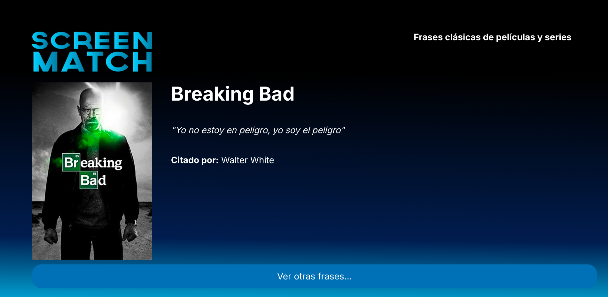
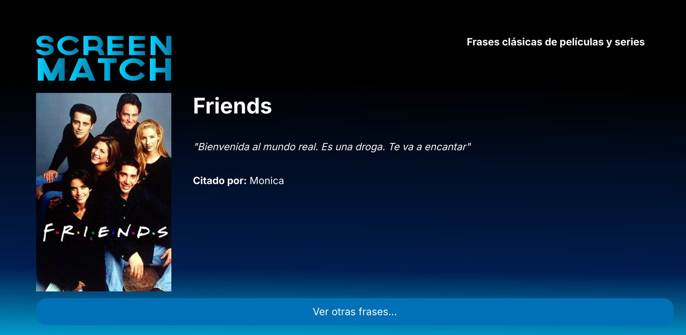

# Generador de frases - ScreenMatch

## Descripcion:
🚀 Este proyecto es una API de frases aleatorias desarrollada en 
Java con Spring Framework y base de datos PostgreSQL.

🎯 El objetivo era crear una API robusta e integrar de manera 
eficiente una aplicación backend con una aplicación frontend.

🎓 Forma parte de la especialización en backend con Java y Spring
Framework del programa ONE (Oracle Next Education).

